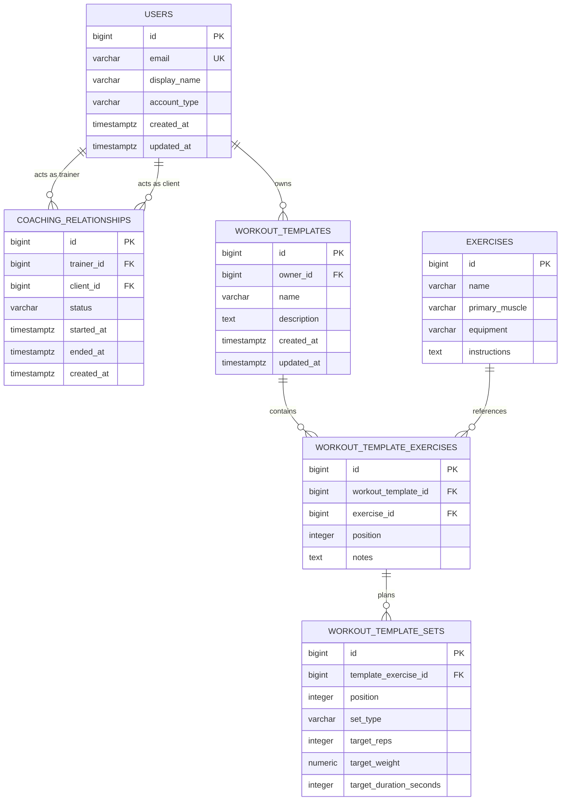

# SetForge Data Model

This document describes the current SetForge database model, the purpose of each entity, and the
rules that connect them. Update it whenever an entity, relationship, or database constraint
changes.

The executable database files are:

- [`schema.sql`](./schema.sql) creates the tables, constraints, and indexes.
- [`dev-data.sql`](./dev-data.sql) inserts local development data and must never be used as
  production user data.

## Current relationship diagram

## Entity catalogue

### User

Database table: `users`

A user is an account that can use SetForge. Both account types use the same table so shared
features, such as owning a workout template or logging a workout, do not require duplicate models.

`account_type` currently supports:

- `PERSONAL_TRAINER`
- `INDIVIDUAL`

The email address uniquely identifies an account. Authentication fields are intentionally absent
until the authentication design is implemented.

Relationships:

- A user can be the trainer in many coaching relationships.
- A user can be the client in many coaching relationships.
- A user can own many workout templates, regardless of account type.

### CoachingRelationship

Database table: `coaching_relationships`

A coaching relationship connects one personal trainer to one individual. It is a separate entity
instead of a `trainer_id` column on `users` so an individual can have multiple trainers and the
application can preserve ended relationships.

`status` supports:

- `PENDING`: the relationship has been requested but is not active yet.
- `ACTIVE`: the trainer currently coaches the client.
- `ENDED`: the relationship is historical.

Rules:

- `trainer_id` and `client_id` must reference different users.
- The same trainer-client pair can have only one `PENDING` or `ACTIVE` relationship at a time.
- Different trainers can have active relationships with the same client.
- When both dates exist, `ended_at` cannot be earlier than `started_at`.
- Role validation, such as requiring the trainer to have account type `PERSONAL_TRAINER`, belongs
  in the service layer because a row-level check cannot inspect another table safely.

### Exercise

Database table: `exercises`

An exercise is a reusable movement in the exercise catalogue. It describes the movement itself,
not its placement in a routine and not a user's performance.

It contains a name, primary muscle, required equipment, and optional instructions. A single
exercise can be referenced by many workout templates.

### WorkoutTemplate

Database table: `workout_templates`

A workout template is a reusable workout plan. It is not a completed workout. Its owner may be an
individual planning their own training or a personal trainer preparing a routine for later
assignment.

Relationships:

- `owner_id` references the user who controls the template.
- A template contains ordered `WorkoutTemplateExercise` rows.

### WorkoutTemplateExercise

Database table: `workout_template_exercises`

This entity places an exercise inside a workout template. A join entity is required because the
placement has its own data: display order and optional template-specific notes.

Rules:

- `position` is zero-based and must be nonnegative.
- A position can occur only once within the same template.
- The same catalogue exercise may appear more than once if it uses a different position.
- Its planned sets belong to this placement, not directly to the catalogue exercise.

### WorkoutTemplateSet

Database table: `workout_template_sets`

A template set describes a planned target. It does not contain actual workout results. Targets are
nullable so the same model can represent repetition, weight, and duration exercises.

`set_type` supports:

- `WARM_UP`
- `NORMAL`
- `DROP_SET`
- `FAILURE`

Rules:

- `position` is zero-based, nonnegative, and unique within its template exercise.
- Repetitions, weight, and duration must be nonnegative when present.
- Weight uses `NUMERIC(8, 2)` in PostgreSQL and `BigDecimal` in Java to avoid floating-point
  rounding errors.

## Ownership and deletion

The current foreign-key behavior is:

| Parent deleted | Result |
| --- | --- |
| User | Their coaching relationships and workout templates are deleted. |
| Workout template | Its template exercises and their template sets are deleted. |
| Workout template exercise | Its template sets are deleted. |
| Exercise referenced by a template | Deletion is rejected to avoid breaking the template. |

Application services should still require an explicit ownership check before modifying or deleting
records. Database cascades protect consistency; they are not an authorization system.

## Persistence conventions

- Primary keys are PostgreSQL `BIGINT` identity values and Java `Long` values.
- Enum values are stored as readable strings. Renaming a Java enum value therefore requires a
  coordinated database update.
- Timestamps use PostgreSQL `TIMESTAMPTZ` and Java `Instant`.
- Ordered child records use a zero-based `position` column rather than relying on database return
  order.
- JPA relationships are lazy and currently unidirectional. Child repositories load ordered rows
  when needed.
- API controllers return DTOs and must not expose JPA entities directly.
- Lombok relationship fields must be excluded from generated `toString` and relationship-based
  equality to avoid recursion and accidental lazy loading.

## Planned entities

These entities are likely next but are not implemented yet:

| Entity | Intended purpose |
| --- | --- |
| `WorkoutSession` | One actual workout performed by any user, optionally based on a template. |
| `WorkoutSessionExercise` | An ordered exercise actually performed during a session. |
| `WorkoutSet` | Actual repetitions, weight, duration, distance, and completion state. |
| `WorkoutAssignment` | A trainer assigning a template to a client for a date or period. |

Actual workout entities must copy the relevant planned values instead of depending on a template
remaining unchanged. This preserves historical accuracy when a template is edited later.

## Updating the model safely

For each model change:

1. Update this document with the new purpose, relationships, and business rules.
2. Update or add the JPA entities and repositories.
3. Update `schema.sql` so a fresh database has the complete current structure.
4. Add explicit `ALTER TABLE` statements for an existing development database when required.
5. Update `dev-data.sql` only when useful sample data is needed.
6. Run structural SQL as `postgres`, then grant data access to `setforge_app`.
7. Start the backend with `ddl-auto: validate` to confirm that JPA and PostgreSQL agree.

`CREATE TABLE IF NOT EXISTS` does not modify an already existing table. Editing a `CREATE TABLE`
section in `schema.sql` is therefore sufficient for new databases but does not migrate an existing
database. Until a migration tool is introduced, existing databases must receive the corresponding
manual `ALTER TABLE` command.
